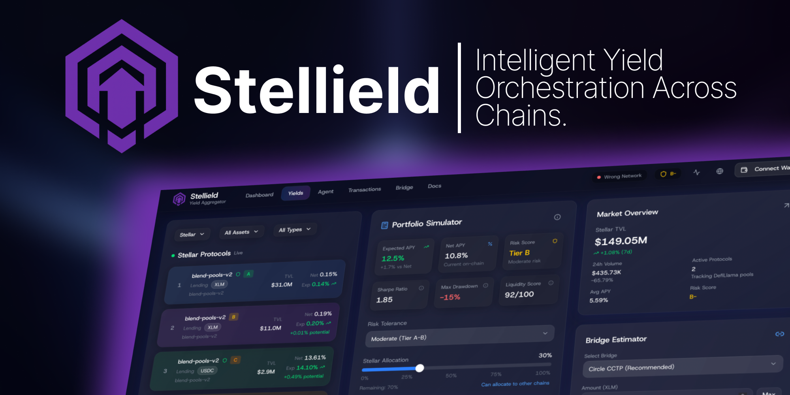

**Quick Links**
- [Web App](apps/web/README.md)
- [API Server](apps/server/README.md)
- [Docs Site](apps/docs/README.md)
- [Bridge Contracts](bridge/README.md)
- [Soroban Orchestrator](contract/README.md)
- [Docker Images](docker/README.md)
- [Shared Packages](packages/README.md)
- [Data Scraper](scraper/README.md)

# Stellield · Intelligent Yield Orchestration Across Chains

> An end-to-end proof of concept that turns Stellar deposits into cross-chain yield strategies, backed by Soroban smart contracts, Circle’s CCTP bridge, and an AI-powered allocation engine.

---

- [Highlights](#highlights)
- [System Architecture](#system-architecture)
- [Repository Layout](#repository-layout)
- [Technology Stack](#technology-stack)
- [Getting Started](#getting-started)
- [Service Deep Dive](#service-deep-dive)
- [Smart-Contract Yield Flow](#smart-contract-yield-flow)
- [AI & Data Pipeline](#ai--data-pipeline)
- [Database & Auth](#database--auth)
- [Tooling & Scripts](#tooling--scripts)
- [Testing & Quality](#testing--quality)
- [Roadmap](#roadmap)
- [Security Notice](#security-notice)
- [License & Acknowledgements](#license--acknowledgements)

---

## Highlights

- **Unified user experience**: Next.js 16 dashboard with portfolio simulation, bridge estimator, live TVL metrics, and risk-adjusted yield cards.
- **Programmable backend**: Elysia + tRPC server orchestrates flows, exposes typed APIs, and speaks to Soroban, Solana, and Circle CCTP kits.
- **Agentic intelligence**: FastAPI service powered by Google Gemini 2.0 Flash delivers explainable allocations tuned to risk tolerance and liquidity.
- **Cross-chain rails**: Soroban vault + mock oracle, Hardhat CCTP contracts, and TypeScript orchestrators simulate XLM→USDC→Aave→XLM loops.
- **Data foundation**: Go-based scraper hydrates CSV datasets from DeFiLlama, Horizon, CoinGecko, Marinade, and AggreLend for ML training.

---

## System Architecture

```
┌─────────────────────────────────────────────────────────────────────────────┐
│                                 Frontend (web)                              │
│  Next.js 16 · React 19 · Tailwind · Shadcn · Privy · React Query            │
│  └─ Dashboard, simulator, bridge panel, yield explorer                      │
└─────────────────────────────────────────────────────────────────────────────┘
                │ GraphQL-like RPC (tRPC over HTTP) │
┌─────────────────────────────────────────────────────────────────────────────┐
│                           API Server (apps/server)                          │
│  Elysia + tRPC + BetterAuth + Circle Bridge Kit + Solana/Stellar SDKs       │
│  └─ Routes: health, auth, stellar flow, AI agent proxy                      │
└─────────────────────────────────────────────────────────────────────────────┘
                │ REST/JSON │                          │ Prisma client
┌──────────────────────────────┐        ┌────────────────────────────────────┐
│  AI Agent (agent)            │        │   Database (packages/db)           │
│  FastAPI + Gemini 2.0 Flash  │        │   PostgreSQL + Prisma ORM          │
│  └─ Recommendation engine    │        │   Auth + flow state tables         │
└──────────────────────────────┘        └────────────────────────────────────┘
                │                                         │
                │                         ┌──────────────────────────────────┐
                │                         │  Blockchain & Bridge Layer       │
                │                         │  - Soroban vault/oracle (contract│
                │                         │  - Circle CCTP Solidity (bridge) │
                │                         │  - Solana native interactions    │
                │                         └──────────────────────────────────┘
                │
┌─────────────────────────────────────────────────────────────────────────────┐
│                           Data Engineering (scraper)                        │
│  Go CLI jobs hydrate CSV datasets for the AI engine and dashboards          │
└─────────────────────────────────────────────────────────────────────────────┘
```

---

## Repository Layout

```text
stellar-hackathon/
├── apps/
│   ├── web/         # Next.js dashboard + landing page
│   ├── server/      # Elysia API + tRPC router + BetterAuth
│   └── docs/        # Fumadocs-powered documentation portal
├── packages/
│   ├── api/         # Shared tRPC procedures, routers, services
│   ├── auth/        # BetterAuth wrapper with Prisma adapter
│   └── db/          # Prisma schema, generated client, utilities
├── agent/           # FastAPI Gemini agent & recommendation engine
├── contract/        # Soroban + TypeScript orchestrator for XLM↔USDC↔Aave
├── bridge/          # Circle CCTP Solidity contracts + Hardhat scripts
├── scraper/         # Go data ingestor producing ML-ready CSVs
├── docker/          # Dockerfiles for web/server/docs/agent
├── docker-compose.yml
├── images/          # Marketing assets (GitHub banner, etc.)
└── plan/            # Implementation roadmap and stage breakdowns
```

---

## Technology Stack

| Layer          | Key Libraries & Tools                                                                              |
|----------------|----------------------------------------------------------------------------------------------------|
| Frontend       | Next.js 16, React 19, Tailwind, Shadcn UI, Privy Auth, TanStack Query/Form, Recharts              |
| API            | Elysia, tRPC, BetterAuth, Prisma, Circle Bridge Kit, Solana Web3, Viem, Zod                        |
| AI Agent       | FastAPI, Pydantic, Loguru, Google Gemini 2.0 Flash, asyncio, custom data aggregator                |
| Smart Contracts| Soroban (Rust), Circle CCTP (Solidity/Hardhat), TypeScript orchestrators for Stellar/Ethereum      |
| Data           | Go 1.21+, CSV exports, rate-limited HTTP client, structured logging                                |
| Tooling        | pnpm, TurboRepo, tsdown/tsgo, Prisma, Docker Compose, UV / pip, Uvicorn                            |

---

## Getting Started

### Prerequisites

- Node.js **>= 18.18** (Next.js 16 compatible)
- pnpm **>= 8**
- Rust toolchain (for Soroban contracts)
- Go **>= 1.21** (for the scraper)
- Python **>= 3.10** (for the AI agent) + UV or pip
- Docker (optional, for full-stack containers)
- A PostgreSQL instance (Docker service is provided)

### 1. Install dependencies

```bash
pnpm install
```

The root `package.json` uses Turbo workspace filters; individual apps install their own dependencies automatically.

### 2. Environment configuration

1. Copy the sample environment:

   ```bash
   cp .env.production.example .env
   ```

2. Fill in:
   - `POSTGRES_*` credentials
   - `BETTER_AUTH_SECRET` and `CORS_ORIGIN`
   - `NEXT_PUBLIC_*` URLs for the web app
   - `GEMINI_API_KEY` for the agent (https://makersuite.google.com/app/apikey)
   - Circle bridge keys (`STELLAR_PRIVATE_KEY`, `SOLANA_PRIVATE_KEY`, etc.)
   - Optional: `VALIDATION_CLOUD_API_KEY`, Privy App ID

3. For local development you can replace production domains with `http://localhost` equivalents.

### 3. Database setup

Spin up Postgres (locally or via Docker), then:

```bash
pnpm db:push         # Apply Prisma schema
pnpm db:generate     # Generate Prisma client
pnpm db:studio       # Explore the data (optional)
```

### 4. Run services locally

In separate terminals (Turbo handles incremental builds):

```bash
pnpm dev:server   # Starts Elysia+tRPC API on http://localhost:3000
pnpm dev:web      # Starts Next.js dashboard on http://localhost:3001
pnpm dev:docs     # Optional docs site on http://localhost:3002
```

Start the Python agent:

```bash
cd agent
uv venv && uv pip install -e .    # or `python -m venv venv && pip install -r requirements.txt`
source .venv/bin/activate         # (Windows: .venv\Scripts\activate)
python run_server.py              # FastAPI on http://localhost:8000
```

If you need simulated data for development, the tRPC `stellar` router provides mocked swap quotes and flow execution out of the box.

### 5. Contracts & bridge toolchain

- **Soroban** (`contract/`): `pnpm dev`, `pnpm build`, and scripts under `scripts/` (`deploy-all.sh`, `test-flow.sh`) handle end-to-end demos.
- **Hardhat CCTP** (`bridge/`): `pnpm compile`, `pnpm test`, `pnpm deploy:sepolia` set up MockUSDC, TokenMessenger, and MessageTransmitter.

Refer to the dedicated READMEs in those directories for network credentials and walkthroughs.

### 6. Run with Docker Compose

```bash
docker-compose up --build
```

This spins up Postgres, the agent (FastAPI), the server, the web app, and docs with health checks. Override environment variables via `.env` or shell exports.

---

## Service Deep Dive

For focused setup instructions, see the app guides:
- [apps/web/README.md](apps/web/README.md) — Next.js dashboard
- [apps/server/README.md](apps/server/README.md) — Elysia+tRPC API
- [apps/docs/README.md](apps/docs/README.md) — Fumadocs site

- **`apps/web`** – Landing page + authenticated dashboard with:
  - Portfolio simulator, allocation sliders, multi-chain tabs
  - Real-time TVL/APY cards powered by DeFiLlama + custom formatting utilities
  - Bridge estimator and transaction timeline views
  - Privy integration scaffold for wallet login

- **`apps/server`** – Elysia node adapter with:
  - `/trpc/stellar.*` procedures for swap quotes, flow orchestration, statistics
  - `/trpc/agent.*` proxy endpoints to the Python recommendation API
  - `/api/auth/*` routes served by BetterAuth (email/password with secure cookies)
  - Native Solana test harnesses (`pnpm test:solana`, etc.)

- **`packages/api`** – tRPC routers and services:
  - `stellarYieldService` simulates the 12-step cross-chain lifecycle
  - `agentApiService` wraps FastAPI endpoints with zod validation
  - Shared context builder linking BetterAuth sessions into procedure guards

- **`agent`** – FastAPI application featuring:
  - Async recommendation engine combining on-chain data and Gemini insights
  - Risk scoring, liquidity filtering, and allocation shaping
  - Detailed health endpoints for observability

- **`contract`** – TypeScript orchestrator for Soroban + Aave flow:
  - Deposit/withdraw scripts, Mercury swap integration, Circle attestation pipeline
  - `scripts/test-flow.sh` runs a full simulated XLM→SOL→USDC loop

- **`bridge`** – Solidity adaptation of Circle CCTP:
  - MockUSDC token, TokenMessenger, MessageTransmitter contracts
  - Deployment + verification scripts targeting Ethereum Sepolia

- **`scraper`** – Go CLI for dataset generation:
  - Modular scrapers per data source, CSV exporter, rate-limited HTTP client
  - Configurable via `configs/config.yaml` and CLI flags

- **`apps/docs`** – Fumadocs site for publishing API/contract notes and operator runbooks.

---

## Smart-Contract Yield Flow

1. **Deposit on Stellar** – User deposits XLM into the Soroban vault; mock oracle tracks rates.
2. **Swap & Bridge** – Simulated Mercury swap converts XLM→USDC; Circle CCTP burn/attestation/mint moves funds to Ethereum (TokenMessenger, MessageTransmitter).
3. **Yield on Ethereum/Solana** – Funds supply to Aave (simulated aUSDC) or Solana native programs via Circle SDK adapters.
4. **Accrue & Track** – `stellarYieldService` records events, risk states, and estimated APY uplift.
5. **Bridge Back & Exit** – Reverse CCTP mint, swap USDC→XLM, return principal + yield.

Each step can be inspected via the tRPC `getFlowStatus` procedure or the dashboard timeline.

---

## AI & Data Pipeline

- **Data ingestion**: `scraper/` collects historic TVL, APY, risk metrics, liquidity pools, and price feeds into timestamped CSVs ready for ML.
- **Aggregation**: `agent/src/data/aggregator.py` merges DeFiLlama pools with Stellar Horizon liquidity and local rule-based risk scoring.
- **Recommendation engine**: Gemini 2.0 Flash receives filtered opportunities, user constraints, and computed risk distribution; returns allocations, rationale, projected returns, and fee estimates.
- **API contract**: `RecommendationResponse` mirrors Pydantic models for typed consumption inside the web app and server.

---

## Database & Auth

- **Prisma schema** (`packages/db/prisma/schema/`):
  - Auth tables (`User`, `Session`, `Account`, `Verification`) powering BetterAuth
  - Placeholder `schema.prisma` ready for yield flow persistence extensions
- **Adapter** (`packages/auth`) configures BetterAuth with secure cookies, Prisma adapter, and cross-origin settings.
- **Access control**: `protectedProcedure` gate keeps tRPC methods requiring authentication; sessions are injected via request headers.

---

## Tooling & Scripts

| Command                               | Description                                         |
|---------------------------------------|-----------------------------------------------------|
| `pnpm dev`                            | Run all dev targets via Turbo (use filters for apps)|
| `pnpm dev:web` / `pnpm dev:server`    | Start web or API services individually             |
| `pnpm typecheck` / `pnpm build`       | Run workspace-wide type-check and build             |
| `pnpm db:*`                           | Prisma database workflows                           |
| `pnpm test:solana` (server)           | Exercises native Solana pipeline integration       |
| `contract/scripts/*.sh`               | Soroban deployment + flow demos                    |
| `bridge/scripts/*.ts`                 | Hardhat deployment helpers                          |
| `agent/examples/*.py`                 | Sample recommendation CLI and risk profile runs     |
| `scraper` CLI flags                   | `./scraper.exe --scrapers=defillama,stellar` etc.   |

---

## Testing & Quality

- **Frontend**: React Compiler-ready; linting is handled through Turbo tasks (add Vitest/Playwright as next steps).
- **Backend**: Use `pnpm typecheck` for static validation and targeted `tsx` scripts for scenario testing.
- **Agent**: `python test_install.py` verifies environment, unit tests under `tests/`.
- **Scraper**: `go test ./...` and CLI dry runs ensure API contracts stay valid.
- **Contracts**: `cargo test` (Soroban) and `pnpm test` (Hardhat) confirm smart-contract behavior.

Add CI workflows to automate these checks before production deployment.

---

## Roadmap

- Replace simulated swap/bridge steps with live integrations (Mercury, Circle APIs).
- Expand Prisma models to capture real flow telemetry and user portfolios.
- Harden the recommendation engine with caching, retraining datasets, and explainability dashboards.
- Ship the Next.js dashboard to production (Privy auth, wallet actions, notifications).
- Document full operator runbook inside `apps/docs`.

Refer to `plan/` for stage-by-stage implementation details.

---

## Security Notice

> ⚠️ This codebase is a hackathon proof-of-concept.  
> Do **not** deploy with real funds without completing security audits, key management hardening, and production readiness reviews.

- Contracts and bridge logic have not been audited.
- Admins retain privileged control for demos.
- Mock data sources and simulated flows are present—verify before enabling on mainnet.

---

## License & Acknowledgements

- **License**: MIT (see [`LICENSE`](LICENSE))
- **Built for**: Stellar Hackathon (Ostim 2025)
- **Shout-outs**:
  - Stellar Development Foundation & Soroban docs
  - Circle CCTP specification and tooling
  - DeFiLlama, Marinade, AggreLend, CoinGecko APIs
  - ValidationCloud for RPC infrastructure